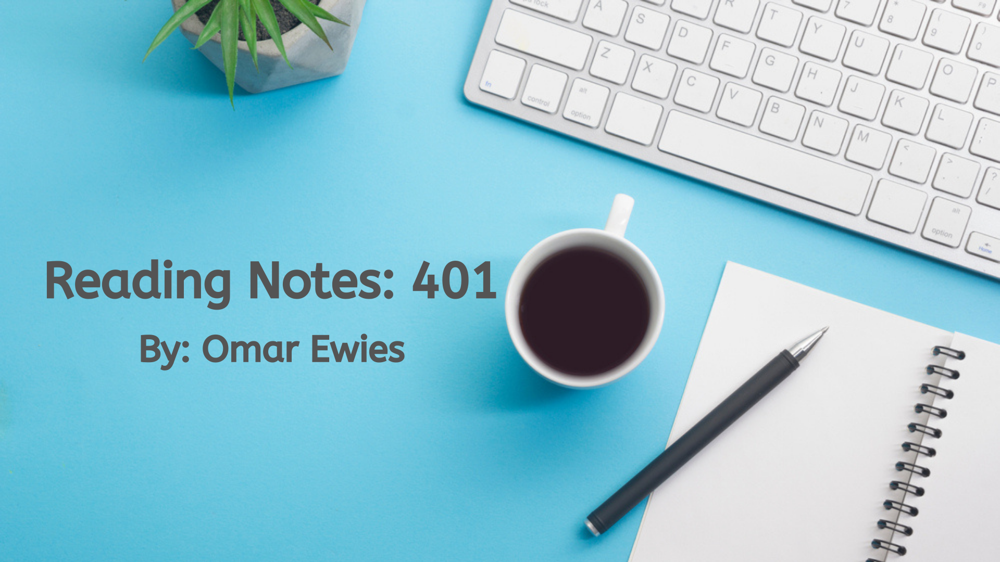

# Code 401 Reading Notes

Here you will find my notes for **Code 401
Advanced Software Development.**

 Feel free to bookmark this to keep an eye on my Notes updates.

## Table of content

Read Num | Read title | Read link
------------ | ------------- | --------------
00 |  Get Ready for 401| [Click here](https://oebitw.github.io/401-notes/articles/read00)
01 |  Node Ecosystem, TDD, CI/CD | [Click here](https://oebitw.github.io/401-notes/articles/read01)
02 |  Express | [Click here](https://oebitw.github.io/401-notes/articles/read02)
03 |  Express REST API | [Click here](https://oebitw.github.io/401-notes/articles/read03)
04 |  Data Modeling | [Click here](https://oebitw.github.io/401-notes/articles/read04)
05 |  Linked List | [Click here](https://oebitw.github.io/401-notes/articles/read05)
06 |  Authentication | [Click here](https://oebitw.github.io/401-notes/articles/read06)
07 |  Bearer Authorization | [Click here](https://oebitw.github.io/401-notes/articles/read07)
08 |  Access Control (ACL) | [Click here](https://oebitw.github.io/401-notes/articles/read08)
09 |  stacks and queues | [Click here](https://oebitw.github.io/401-notes/articles/read09)
10 |  O Auth | [Click here](https://oebitw.github.io/401-notes/articles/read10)
11 |  Event Driven Applications| [Click here](https://oebitw.github.io/401-notes/articles/read11)
12 |  Socket.io| [Click here](https://oebitw.github.io/401-notes/articles/read12)
13 |  Message Queues| [Click here](https://oebitw.github.io/401-notes/articles/read13)
14 | Event Driven Architecture| [Click here](https://oebitw.github.io/401-notes/articles/read14)
15 | Trees | [Click here](https://oebitw.github.io/401-notes/articles/read15)
16 | AWS: Cloud Servers | [Click here](https://oebitw.github.io/401-notes/articles/read16)
17 |  AWS: S3 and Lambda| [Click here](https://oebitw.github.io/401-notes/articles/read17)
18 |  AWS: API, Dynamo and Lambda| [Click here](https://oebitw.github.io/401-notes/articles/read18)
19 |  AWS: Events| [Click here](https://oebitw.github.io/401-notes/articles/read19)
26 |  Component Based UI| [Click here](https://oebitw.github.io/401-notes/articles/read26)
27 | Props and State| [Click here](https://oebitw.github.io/401-notes/articles/read27)
28 |Component Composition | [Click here](https://oebitw.github.io/401-notes/articles/read28)
29 |Routing | [Click here](https://oebitw.github.io/401-notes/articles/read29)
30| Hashtable | [Click here](https://oebitw.github.io/401-notes/articles/read30)
31| Hooks API | [Click here](https://oebitw.github.io/401-notes/articles/read31)
32| Custom Hooks| [Click here](https://oebitw.github.io/401-notes/articles/read32)
33| Context API| [Click here](https://oebitw.github.io/401-notes/articles/read33)
34| `<Login/>` and `<Auth/>` | [Click here](https://oebitw.github.io/401-notes/articles/read34)
35| Graphs | [Click here](https://oebitw.github.io/401-notes/articles/read35)
36|  Application State with Redux | [Click here](https://oebitw.github.io/401-notes/articles/read36)
37|  Redux - Combined Reducers | [Click here](https://oebitw.github.io/401-notes/articles/read37)
38| Redux - Asynchronous Actions | [Click here](https://oebitw.github.io/401-notes/articles/read38)

