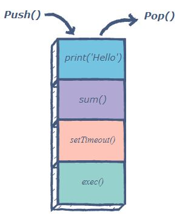
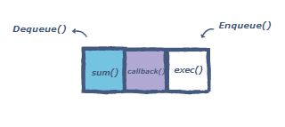
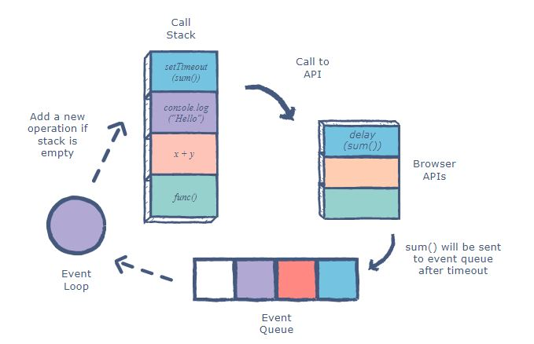

# Get Ready for 401

## How to Solve Programming Problems

Start writing code without understanding the problem is the most common mistake between developers.

To avoid this serious issue you have to:

1) Read the problem completely twice.
2) Solve the problem manually with 3 sets of sample data.
3) Optimize the manual steps.
4) Write the manual steps as comments or pseudo-code.
5) Replace the comments or pseudo-code with real code.
6) Optimize the real code.

## How to think like a programmer ?

To think like a problem, first you have to master problem solving.

We all have problems. Big and small. How we deal with them is sometimes, well…pretty random.

Unless you have a system, this is probably how you “solve” problems:

1) Try a solution.
2) If that doesn’t work, try another one.
3) If that doesn’t work, repeat step 2 until you luck out.

This steps are so Effective in solving problems:

### Understand

Know exactly what is being asked. Most hard problems are hard because you don’t understand them (hence why this is the first step).

### Plan

Don’t dive right into solving without a plan (and somehow hope you can muddle your way through). Plan your solution!

### Divide

Do not try to solve one big problem. 

Instead, break it into sub-problems. These sub-problems are much easier to solve.

Then, solve each sub-problem one by one. Begin with the simplest. Simplest means you know the answer (or are closer to that answer).

### Stuck?

First off, take a deep breath. Second, that’s fair.

Don’t worry though. This happens to everyone!

The difference is the best programmers/problem-solvers are more curious about bugs/errors than irritated.

In fact, here are three important things to try when facing a whammy:
1) Debug
2) Reassess
3) Research

### Practice

Don’t expect to be great after just one week. If you want to be a good problem-solver, solve a lot of problems!

## 5 Whys

Five whys (or 5 whys) is an iterative interrogative technique used to explore the cause-and-effect relationships underlying a particular problem. The primary goal of the technique is to determine the root cause of a defect or problem by repeating the question "Why?". Each answer forms the basis of the next question.

## Concurrency model and the event loop

JavaScript has a concurrency model based on an event loop, which is responsible for executing the code, collecting and processing events, and executing queued sub-tasks. This model is quite different from models in other languages like C and Java.

### call stack

The call stack is responsible for keeping track of all the operations in line to be executed. Whenever a function is finished, it is popped from the stack.

### event queue

The event queue is responsible for sending new functions to the track for processing. It follows the queue data structure to maintain the correct sequence in which all operations should be sent for execution.

Whenever an async function is called, it is sent to a browser API. These are APIs built into the browser. Based on the command received from the call stack, the API starts its own single-threaded operation.

